# SAST with DVWA Project

## Project Overview

This project demonstrates performing **Static Application Security Testing (SAST)** using **SonarQube** on the **Damn Vulnerable Web Application (DVWA)** to identify security vulnerabilities and improve code quality. The DVWA is a PHP/MySQL web application that aims to be an educational tool for security professionals.

---

## Warning

Damn Vulnerable Web Application (DVWA) is a PHP/MySQL web application that is damn vulnerable. Its main goal is to be an aid for security professionals to test their skills and tools in a legal environment, help web developers better understand the processes of securing web applications and to aid both students & teachers to learn about web application security in a controlled class room environment.

The aim of DVWA is to practice some of the most common web vulnerabilities, with various levels of difficulty, with a simple straightforward interface. Please note, there are both documented and undocumented vulnerabilities with this software. This is intentional. You are encouraged to try and discover as many issues as possible.


---

## Pre-requisites

   * Operating System: Debian-based system (Kali, Ubuntu, Kubuntu, Linux Mint, Zorin OS)
   * Docker
   * SonarQube
   * SonarQube Scanner
   * Java 17
   * Clone the project from [DVWA Project](https://github.com/cybergauravv/SAST-DVWA.git).

### Let's move to implemetation steps of this project.

---
## Project Implemetation

### 1. Install Docker & Start Docker Service

#### Open Your Terminal and run below:

```
sudo apt-get update

sudo apt-get install -y docker.io

sudo systemctl start docker

sudo systemctl enable docker
```
---
### 2. Install Git

```
sudo apt-get install -y git
```
---
### 3. Pull the SonarQube Latest Docker image

```
sudo docker pull sonarqube:latest
```
---
### 4. Run SonarQube

```
sudo docker run -d --name sonarqube -p 9000:9000 sonarqube:latest
```
#### Verify docker process:

```
docker ps
```

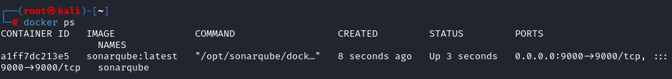

---
### 5. Access SonarQube 

   * Open your browser and navigate to `http://localhost:9000`.

   * Log in with default credentials Username: `admin` and Password: `admin` change the password for further use.


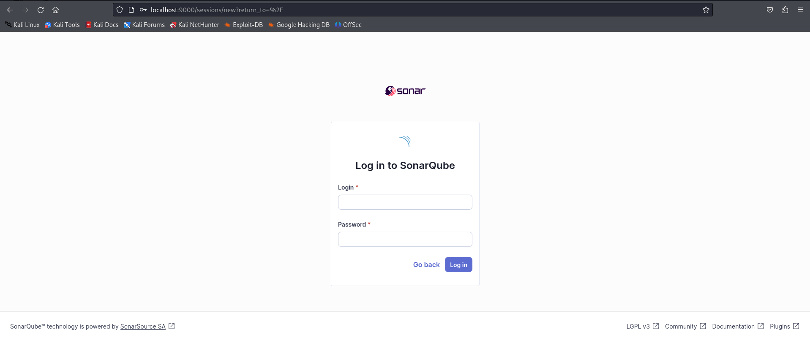

   
> #### Note: SonarQube might take some time to load depending upon your resource usage.

#### Create New Project On SonarQube:

* Click on the "+" icon in the top-right corner of the dashboard.

   * Select "Create Project" from the dropdown menu.

   * Choose the project type (e.g., Local, GitHub, GitLab, etc.).

   * Enter the project name, project key, and other required details.
 
  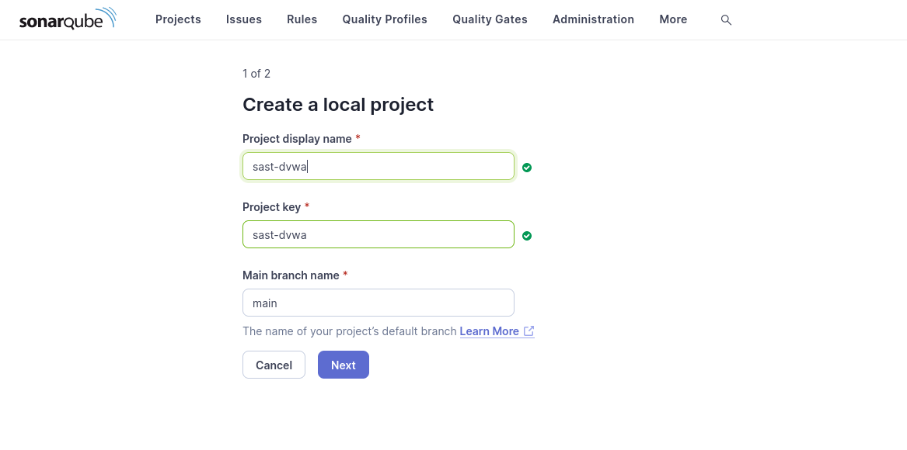

   * Click "Create" to create the project.
 
   * On second page, "Setup project as Clean As You Code" Select below:
 
  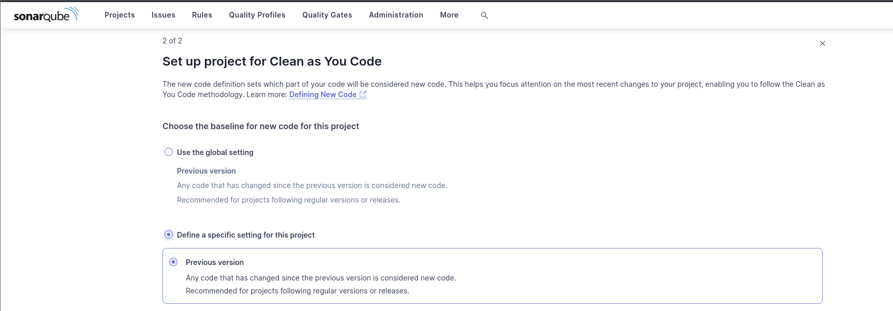


#### Generate A Token:

  * Go to User > My Account > Security.

  * Click on the "Generate" button next to "Tokens".

  * Select the token type (e.g., User, Project Analysis, Global Analysis).

  * Choose an expiration date for the token (optional).

  * Click "Generate" to create the token.

  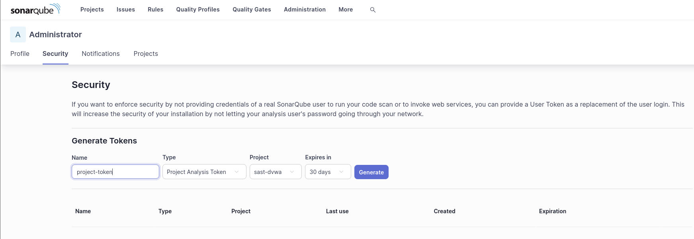

  * Copy the generated token value for further use.
---


### 6. Create a directory for your project

```
mkdir <your-directory>
```
#### Navigate to your directory
```
cd <your-directory> 
```
---
### 7. Clone the DVWA project

```
git clone `https://github.com/cybergauravv/SAST-DVWA.git`
```

#### Navigate to the project directory:

```
cd your-directory/SAST-DVWA
```
---
### 8. Install SonarQube Scanner

```
wget https://binaries.sonarsource.com/Distribution/sonar-scanner-cli/sonar-scanner-cli-4.6.2.2472-linux.zip
```
---
### 9. Unzip Downloaded File

```
unzip sonar-scanner-cli-4.6.2.2472-linux.zip

mv sonar-scanner-4.6.2.2472-linux/ sonar-scanner
```
---
### 10. Configure SonarQube Scanner

#### Open the configuration file:

```
nano ~/SAST-DVWA/sonar-scanner/conf/sonar-scanner.properties
```

#### Add the following to the configuration file:

```
sonar.projectKey=<Your-Project-Key>
sonar.projectName=<Your-Project-Name>
sonar.projectVersion=1.0
sonar.sources=.
sonar.inclusions=**/*.php
sonar.language=php
sonar.sourceEncoding=UTF-8
sonar.host.url=http://localhost:9000
sonar.login=<your-sonarqube-token>
sonar.exclusions=**/config/**,**/docs/**,**/external/**,**/README*.md,**/*.txt
```

> #### Note: Replace the `ProjectKey`, `ProjectName` and `YourToken` from values generated from SonarQube Project.

#### Save & Exit:

* Press `Ctrl + X`, then `Y`, and `Enter` to save and close the file.

> #### Note: When running sonar-scanner I see the script is setting up the environment variables. The issue seems to be `use_embedded_jre=true`, which forces SonarScanner to use its own JRE, ignoring the system settings. We need to disable this and force it to use `Java 17`.
> To fix this:

#### Navigate to the Directory: 
Open the sonar-scanner run file in a text editor. Run the following command:

```
nano ~/your-directory/SAST-DVWA/sonar-scanner/bin/sonar-scanner
```
#### Make below changes to script:

1. Change `use_embedded_jre=true` to `use_embedded_jre=false`

2. Remove the entire block that sets `JAVA_HOME` to the embedded JRE:

#### Remove this block:
```
 if [ "$use_embedded_jre" = true ]; 
then
   export JAVA_HOME="$sonar_scanner_home/jre"
 fi
```
#### Here's how your script should look:

```
use_embedded_jre=false

if [ -n "$JAVA_HOME" ]
then
  java_cmd="$JAVA_HOME/bin/java"
else
  java_cmd="`which java`"
fi

if [ -z "$java_cmd" -o ! -x "$java_cmd" ] ; then
  echo "Could not find 'java' executable in JAVA_HOME or PATH."
  exit 1
fi

project_home=`pwd`

exec "$java_cmd" \
  -Djava.awt.headless=true \
  $SONAR_SCANNER_OPTS $SONAR_SCANNER_DEBUG_OPTS \
  -classpath  "$jar_file" \
  -Dscanner.home="$sonar_scanner_home" \
  -Dproject.home="$project_home" \
  org.sonarsource.scanner.cli.Main "$@"
```

#### Save & Exit:

 * Press `Ctrl + X`, then `Y`, and `Enter` to save and close the file.

---

### 11. Run the SonarQube Scanner

#### Navigate to your project directory:

```
cd your-directory/SAST-DVWA
```

#### Run the SonarQube Scanner:

```
../sonar-scanner/bin/sonar-scanner -X
```

#### Monitor the Output:

* The scanner will show progress in the terminal. Look for a success message indicating that the analysis report has been uploaded to SonarQube.

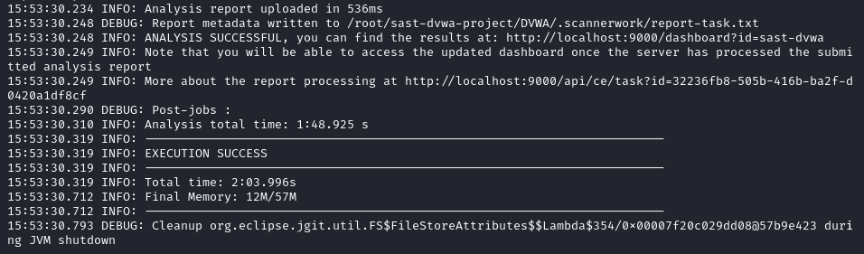

---

### 12. Review the SonarQube Report

### Access SonarQube:

* Open your browser and navigate to `http://localhost:9000`.

* Log in and go to your project (`Your-Project-Name`).

#### Review the analysis report for detected vulnerabilities:

Review the Overview Section

  * Quality Gate Status: Check if the project has passed or failed the quality gate.

  * General Metrics: Look at key metrics such as:
    * Lines of Code (LOC)
    * Code Coverage

  * Duplicated Lines

  * Maintainability Rating

  * Issues Summary: Note the total number of issues, categorized by type (bugs, vulnerabilities, and code smells).


  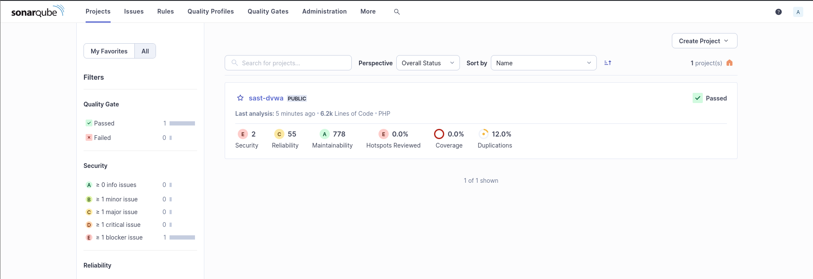

#### Examine Security Hotspots:

Navigate to the `Security Hotspots` tab:

  * Definition: Understand that security hotspots are pieces of code that require review for potential security issues.

  * Review List: Examine the list of hotspots identified by SonarQube.

  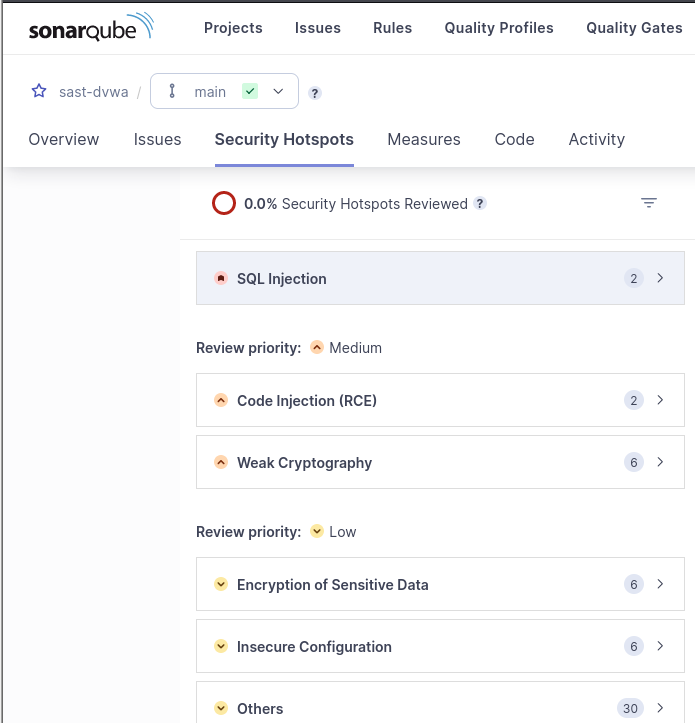

  * Details: Click on individual hotspots to view:
    * The specific code section flagged.
    * The rationale for the flagging (e.g., potential vulnerabilities).

  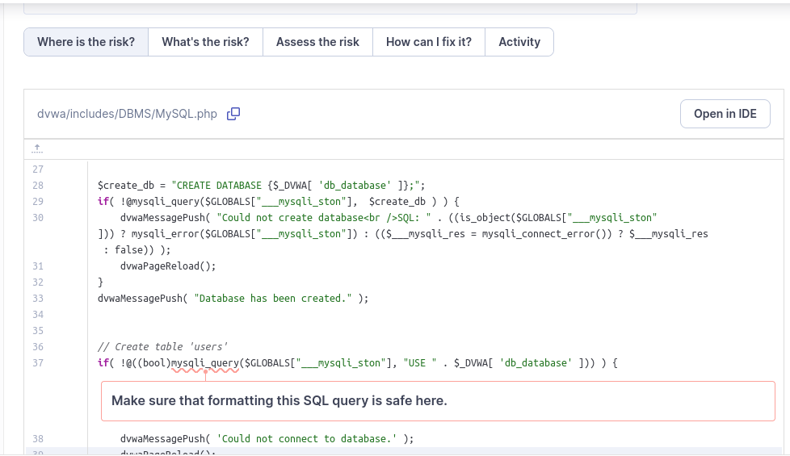

  * Recommendations for remediation.

   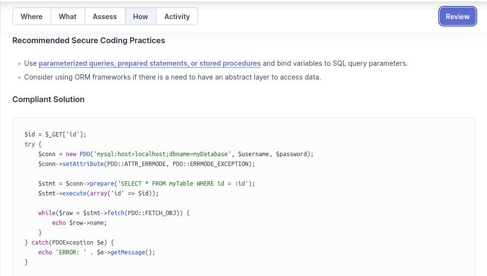

---   

### 13. Prioritize Security Hotspots

  * Assess the severity and potential impact of each hotspot.

  * Prioritize them for review and remediation based on risk.

  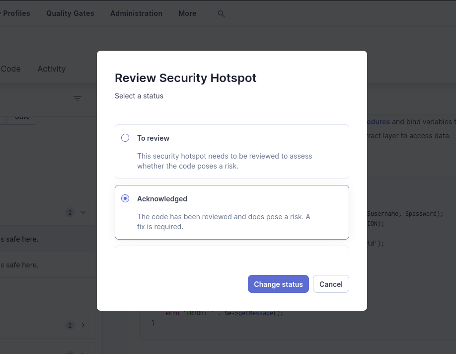

---  

### 14. Document Findings

  * Take notes on key issues and hotspots for discussion with your team.

  * Consider exporting the report for sharing if needed.

  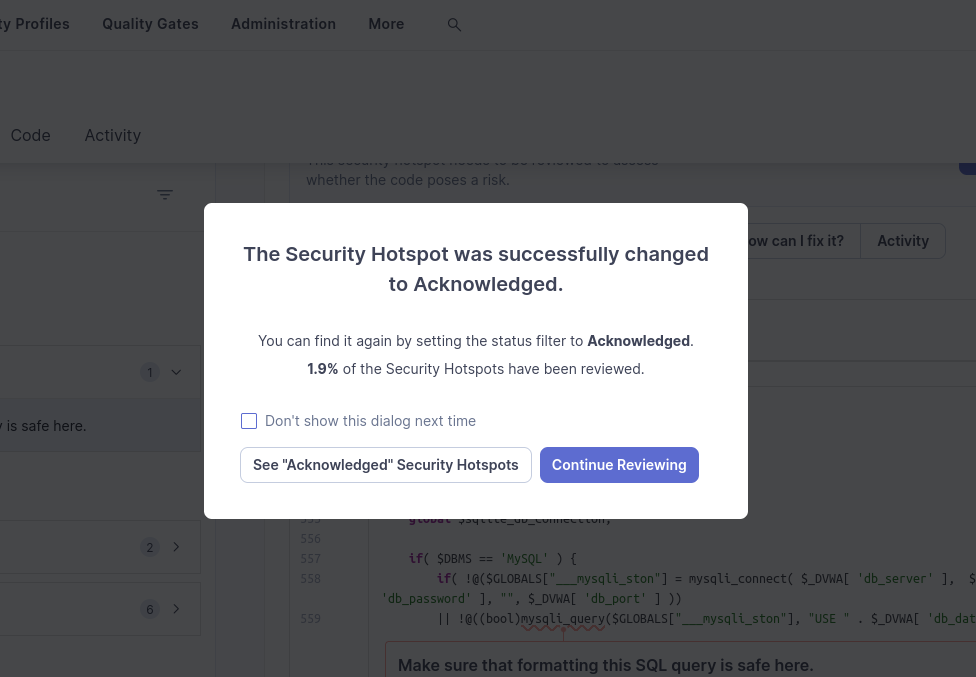

---  

### 15. Plan Remediation

  * Collaborate with your team to address the identified hotspots and improve overall security posture.


---

## Additional Tips

  * Regularly check the Overview and Security Hotspots sections to maintain code quality and security.

  * Use the SonarQube [documentation](https://docs.sonarsource.com/sonarqube/10.7/) for further details on specific metrics and recommendations.


---


# Disclaimer

This project is for educational purposes only. The authors are not responsible for any misuse of the information provided. 
This project serves as a general demonstration of performing Static Application Security Testing (SAST) using SonarQube on the Damn Vulnerable Web Application (DVWA). DVWA is specifically chosen for this demonstration purpose. For more advanced functionalities of SonarQube, please refer to the [official documentation](https://docs.sonarqube.org/).

Individuals interested in configuring and accessing DVWA can visit the original repository [here](https://github.com/digininja/DVWA).

---

# Thank You!


Thank you for checking out this project! Your curiosity and engagement are what keep the world of open source thriving. If you found this project helpful, feel free to star the repo, contribute, or just drop a message. Every bit of feedback helps!

Remember, the quest for learning and improving never ends. Stay curious, stay secure, and happy coding! 🚀

---


Crafted with dash of audacity by **Cybergauravv**. If you have any questions or just want to chat, feel free to reach out via [LinkedIn](https://www.linkedin.com/in/gaurav-soni-992a9a200/).


